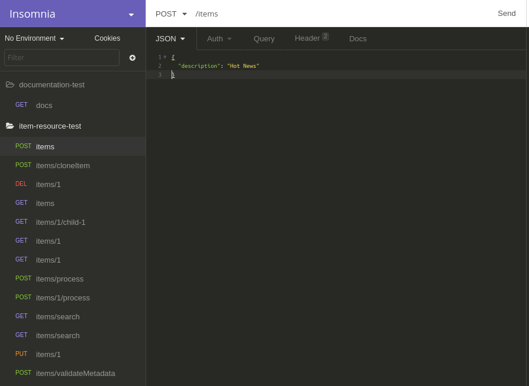
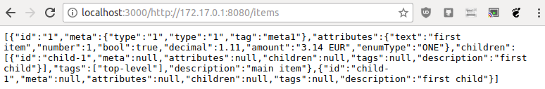
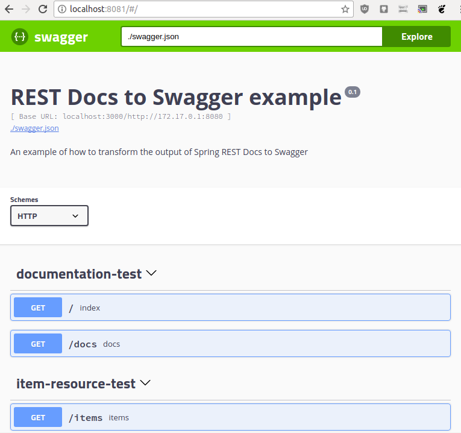
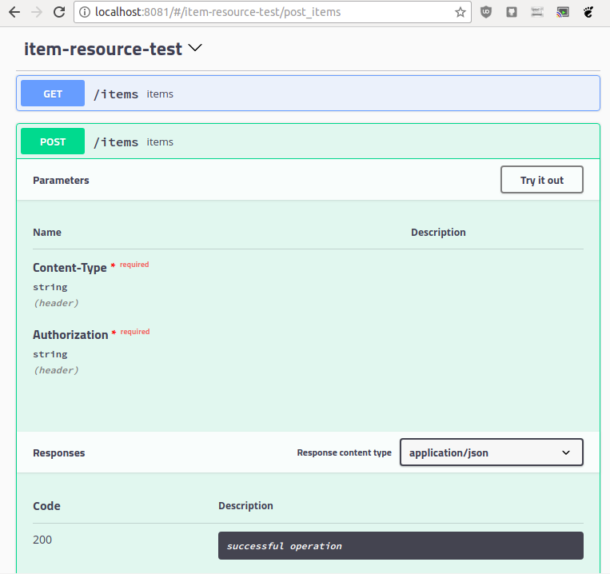
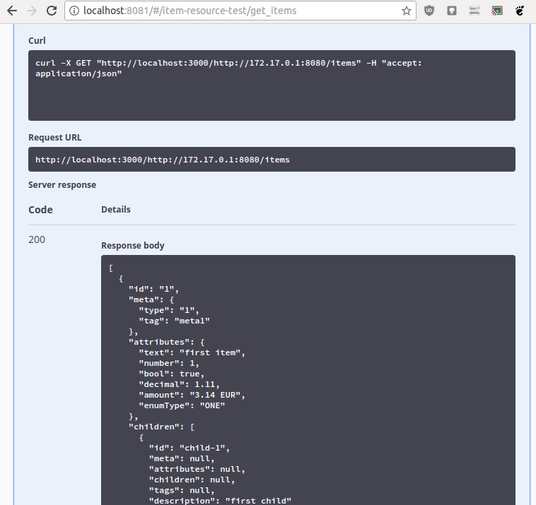

# Swagger playground out of Spring REST Docs

This repository contains instructions for creating a
[Swagger](https://swagger.io/) playground out of the output of
[Spring REST Docs](https://projects.spring.io/spring-restdocs/).
There are likely more ways out there, for example by going via
a Postman collection instead of an Insomnia collection.

Why?
After creating restdocs-to-postman I thought that it shouldn't be
too hard to convert it further to Swagger.
Furthermore, there is an 
[issue on the Spring REST Docs project](https://github.com/spring-projects/spring-restdocs/issues/213)
from March 2013 with several supporters
and people are also asking for it on
[Stack Overflow](https://stackoverflow.com/questions/46432634/including-a-try-out-form-in-spring-rest-docs).

The following steps explain the process with an example, namely
[Spring Auto REST Docs' example project](https://github.com/ScaCap/spring-auto-restdocs/tree/master/spring-auto-restdocs-example)
is used.
For the following steps it does not matter whether Spring REST Docs
or Spring Auto REST Docs is used,
because both produce the very cURL snippets and that is the
only thing that matters.

## 1. Spring REST Docs

First step is creating the Spring REST Docs snippets for the example project.
After checking the project out and going to the folder, once can run:

```bash
$ mvn test
```

This step depends on the project setup and thus another build tool might be used.
The resulting snippets from the example project are also contained in
this repository at `restdocs/generated-snippets`.
The only files that will be used in the next step are the cURL snippets
(`curl-request.adoc`).

## 2. Spring REST Docs to Insomnia collection

This step uses [restdocs-to-postman](https://github.com/fbenz/restdocs-to-postman)
to create an Insomnia collection out of the cURL snippets:

```bash
$ restdocs-to-postman -i restdocs/generated-snippets -e insomnia -f secondLastFolder -r restdocs-to-insomnia/replacements.json -o restdocs-to-insomnia/insomnia-collection.json
```

The replacements do nothing else than removing `http://localhost:8080`
from the URLs.
This way we get relative URLs and can easily configure the base URL
in Swagger.
The origin of `http://localhost:8080` is in the Spring REST Docs configuration
and thus may differ by project.

Sorting requests into folders with `-f secondLastFolder` required,
because `swaggymnia` (used in the next step) crashes on requests
that are not part of a folder.
In Insomnia a folder is called request group.



## 3. Insomnia collection to Swagger JSON

[swaggymnia](https://github.com/mlabouardy/swaggymnia) is used to convert
the Insomnia collection to a Swagger JSON file.

```bash
$ ./swaggymnia generate -insomnia restdocs-to-insomnia/insomnia-collection.json -config insomnia-to-swagger/config.json -output json
```

The result is always placed in `swagger.json`.
You can find the file for this example at `ìnsomnia-to-swagger/swagger.json`.

The `config.json` contains the base URL and descriptions that should
end up in the Swagger file.
The strange base URL `localhost:3000/http://172.17.0.1:8080` is used
in this example and explained in the next step.
You will likely use a different base URL.

## 4. Running Swagger UI

This section explains how to run Swagger UI locally with the help of Docker.

### 4.1 Cross-origin issues

If Swagger UI is running on a different domain than the API
and the API does not add CORS headers that allow cross-origin requests,
the browser will block those requests.

There are several possible solutions. Three of the are:

1. Run Swagger UI on the same domain.
2. Add CORS headers to the API (if that does not weaken security in your case).
3. Use a proxy that adds CORS headers.

Option 3 is used here and a CORS proxy is started:

```bash
$ docker run -p 3000:3000 imjacobclark/cors-container
```

This also explains the strange URL from step 3: `localhost:3000/http://172.17.0.1:8080`.
`172.17.0.1` is the IP of the host system that can be reached from within the Docker container.
Just using `localhost` would not work.

On a Linux system you can get the IP via

```bash
$ ip addr show docker0 | grep -Po 'inet \K[\d.]+'
```

On a Mac using `docker.for.mac.localhost` should work.
There is a discussion on
[Stack Overflow](https://stackoverflow.com/questions/31324981/how-to-access-host-port-from-docker-container)
for this issue.





### 4.2 Start Swagger UI

Copy over the `swagger.json` file to the `swagger-ui` folder
and build and run the Swagger UI Docker image in that folder:

```bash
$ docker build . -t custom-swagger-ui
$ docker run -p 8081:8080 custom-swagger-ui
```

The custom Dockerfile just adds the custom swagger file
to the [swagger-ui](https://hub.docker.com/r/swaggerapi/swagger-ui/)
Docker image.

Afterwards, Swagger UI is running at http://localhost:8081.
If the API and the CORS proxy (if needed) are running as well,
one can start playing around.







